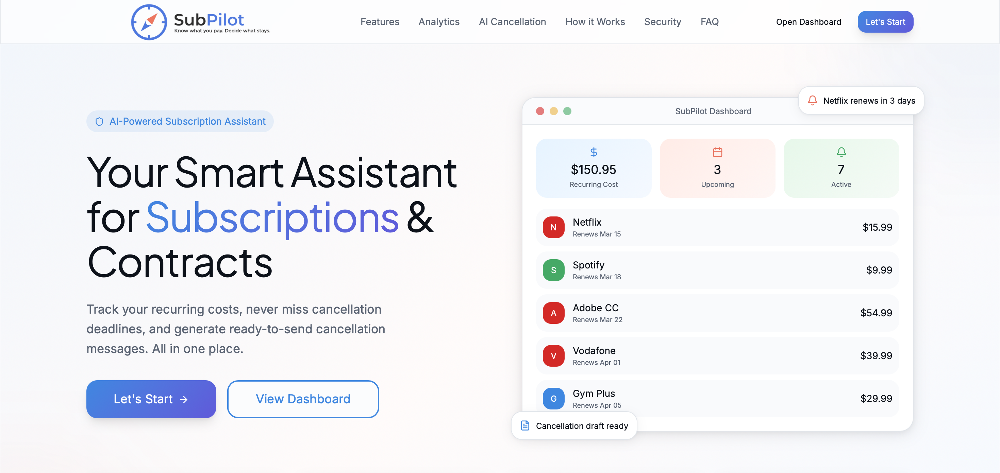
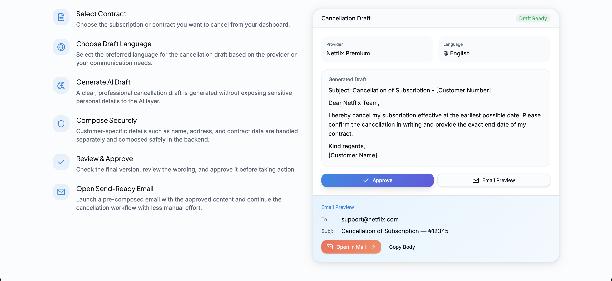
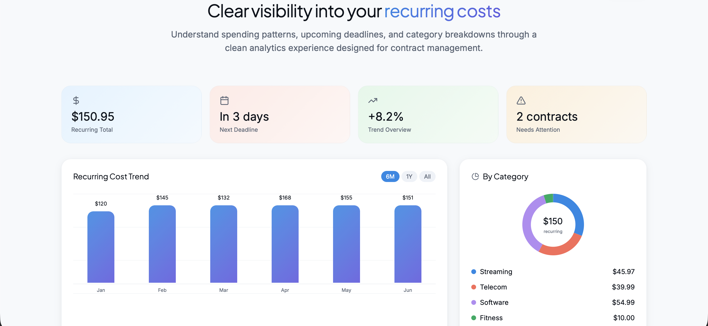
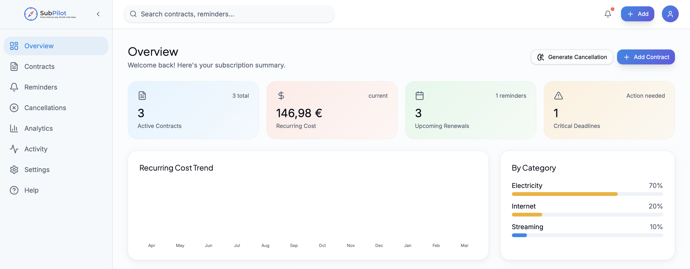

<p align="center">
  
</p>

**Your AI co-pilot for subscriptions and contracts.**

SubPilot is a full-stack web application that helps users manage recurring contracts, track spending, stay ahead of deadlines, and generate AI-assisted cancellation drafts. All in one place.

---

## ✨ Features

### 📊 Core Functionality
- Track subscriptions and contracts in a unified dashboard
- Monitor recurring costs and billing cycles
- Stay ahead of renewal dates and cancellation deadlines
- Visualize spending with analytics and category breakdowns

### 🤖 AI-Powered Workflow
- Generate professional cancellation drafts with AI
- Privacy-first design: no sensitive data sent to the AI layer
- Backend-based composition of final customer-specific letters

### ⚡ Productivity
- Send-ready email drafts
- Activity tracking for all contract changes
- Structured workflow from tracking → decision → cancellation

---

## 🔐 Privacy-First Architecture

SubPilot is designed with a strong focus on data privacy:

- AI generates neutral templates without personal data
- Sensitive information is handled separately in the backend
- Users review and approve all actions before sending

---

## 🧠 Planned Features

- AI-powered spending insights
- Inbox-based subscription detection (opt-in)
- Budget tracking and alerts
- Multi-language contract workflows

---

## 🏗️ Tech Stack

### Backend
- **Python**
- **FastAPI**
- **SQLAlchemy**
- **SQLite** (dev)
- REST API architecture

### Frontend
- **React + TypeScript**
- **Vite**
- **TailwindCSS**
- **Framer Motion**

### AI Integration
- LLM-based cancellation draft generation
- Structured prompt workflows
- Privacy-aware system design

---

## 📸 Preview

<p align="center">
  
</p>

<p align="center">
  
</p>

<p align="center">
  
</p>

<p align="center">
  
</p>

---

## ⚙️ Getting Started

### 1. Clone the repository
```bash
git clone https://github.com/ilyassuelen/subpilot-ai.git
cd subpilot-ai
```

### 2. Backend setup
```bash
cd backend
python -m venv venv
source venv/bin/activate  # or venv\Scripts\activate on Windows
pip install -r requirements.txt
uvicorn app.main:app --reload
```

### 3. Frontend setup
```bash
cd frontend
npm install
npm run dev
```

## 🌐 Project Structure
```plaintext
subpilot-ai/
│
├── app/
│   ├── core/
│   ├── models/
│   ├── routers/
│   ├── schemas/
│   ├── services/
│       ├── ai/
│   ├── main.py
│
├── frontend/
│   ├── public/
│   ├── src/
│       ├── components/
│           ├── contracts/
│           ├── dashboard/
│           ├── landing/
│           ├── reminders/
│           ├── ui/
│       ├── hooks/
│       ├── lib/
│       ├── routes/
│
├── README.md
└── requirements.txt
```

## 🎯 Vision
SubPilot aims to evolve into a smart contract management assistant that:
- Reduces unnecessary spending
- Prevents missed cancellation deadlines
- Automates repetitive contract workflows
- Combines analytics with AI-driven decision support

## 👨‍💻 Author
Ilyas Sülen
- GitHub: https://github.com/ilyassuelen
- LinkedIn: https://www.linkedin.com/in/ilyas-suelen/

## 📄 License
This project is licensed under the MIT License.